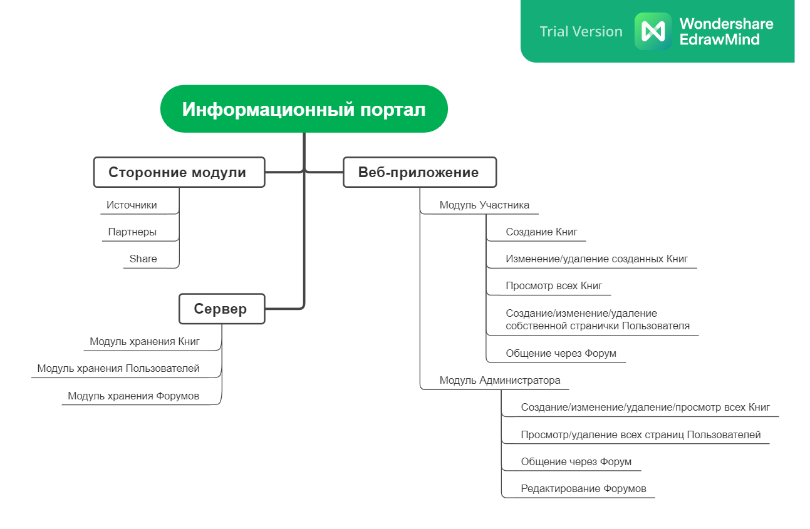
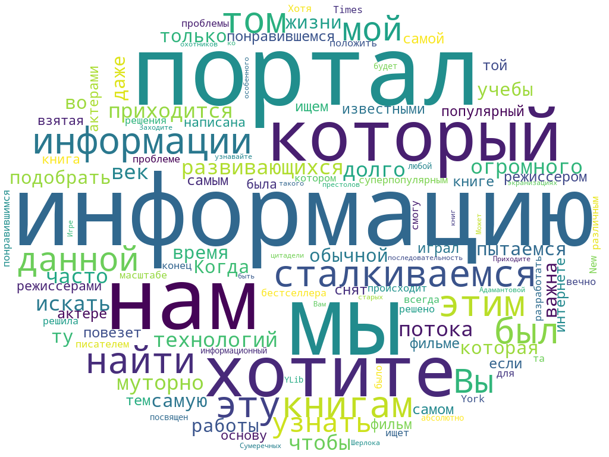

# Инвариантная самостоятельная работа №1

В рамках данной работы нужно было выболнить 2 задания:

1. Разработка карты знания и облака тегов по теме ВКР для включения в ЭУК
1. Проектирование вебинара по теме ВКР с использованием инструментов мобильного ЭО

## Отчет по заданию №1

По ходу выполнения задания №1 были выполнены:

* Интеллект-карта:

    

* Облако слов:

    

## Отчет по заданию №2

Отчет по заданию можно найти, перейдя по [ЭТОЙ](isr1/isr1.3.md) ссылке.