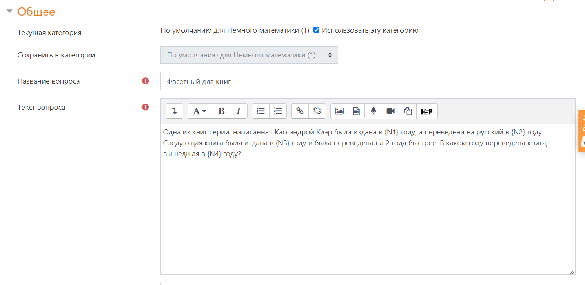
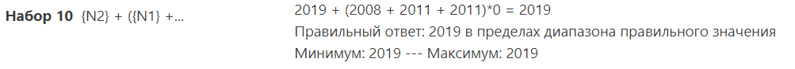
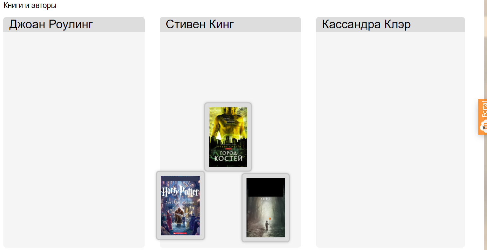

# Инвариантная самостоятельная работа №3

В ходе самостоятельной работы было выполнено два задания.

### 1. Разработка фасетных вопросов по теме ВКР для системы управления обучением.

Для этого я воспользовалась СДО Moodle и получила вопрос, представленный на скриншоте.

Для того, чтобы сгенирировать нужные вопросы, я составила формулу и получила набор вопросов, один из которых представлен ниже.

### 2. Разработка интерактивного задания на перетаскивание для использования в ЭИОС

Для задания я решила использовать средства Moodle и создала вопрос следующего содержания:

И затем разместила данное задание в своем курсе:

