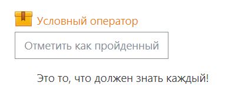

# Инвариантная самостоятельная работа №4

**Задание:** Проектирование отчуждаемого контента и реализация компонента повторного использования с помощью инструмента разработки контента. Интеграция компонента повторного использования в ЭИОС.

Для данного задания был спроектирован небольшой урок на основе презентации PowerPoint. И онбыл выгружен в качестве пакета SCORM в курс мудл.

