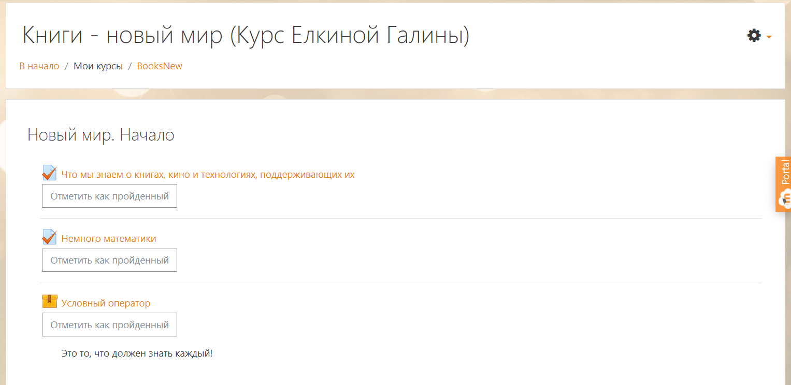
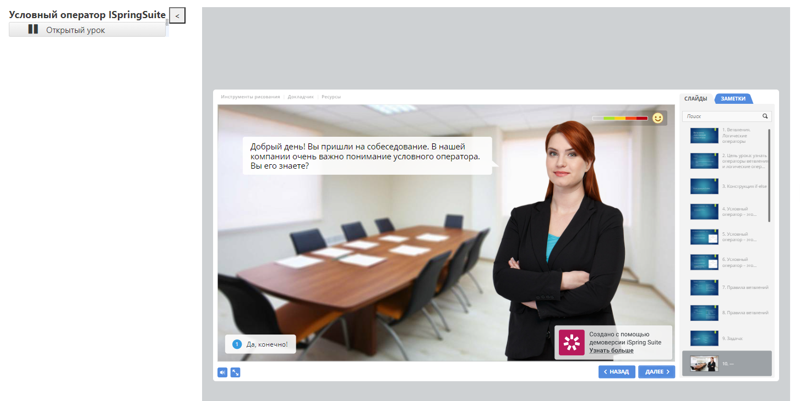

# Отчет по лабораторной работе №3

В ходе лабораторной работы был разработан мини-курс с помощью iSpringSuite, который был помещен всозданный мной курс Moodle.

### Превью курса:

### Превью мини-курса:

Сам мини-курс есть в формате SCORM [здесь](lr3.zip)