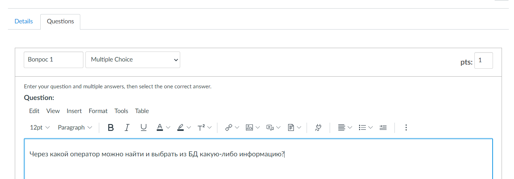

# Вариативная самостоятельная работа №2

### **Задание. Разработка фрагмента ЭУК на платформе Canvas.**

Для создания фрагмента ЭУК я создала аккаун на платформе Canvas.

Затем я создала новый курс, где стала создавать викторину с помощью инструмента Quizzes.

Затем мне предстояло создать несколько вопросов на тему "SQL-запросы к БД". Это было достаточно легко:

Так у меня получилась небольшая викторина для курса!

